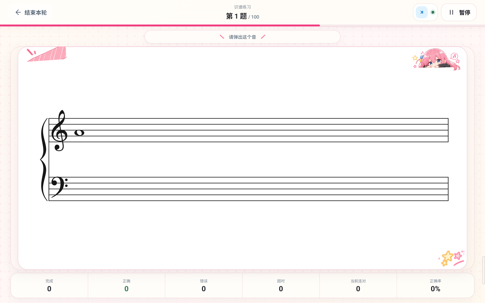
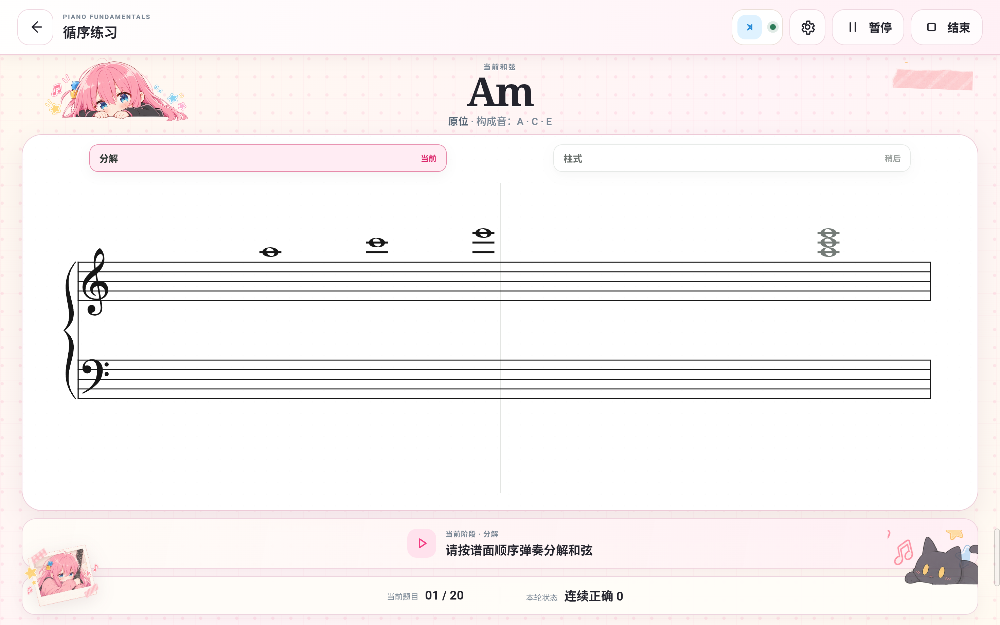
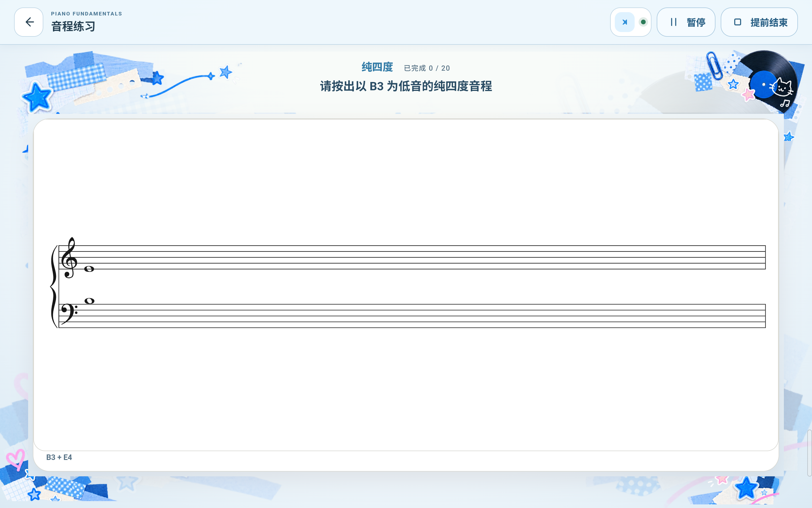

# Piano Fundamentals Trainer Themes

Personalized visual themes for Piano Fundamentals Trainer

为 [Piano Fundamentals Trainer](https://github.com/Natural516/piano-fundamentals-trainer) 提供可安装的个性化视觉主题，让识谱、和弦、音程等练习拥有不同的视觉风格。

**当前主题：Bocchi（孤独摇滚）1.1.0 · 适配 App 1.6.0**

[下载 Bocchi 1.1.0](https://github.com/Natural516/piano-fundamentals-trainer-themes/releases/download/natural516.bocchi-v1.1.0/natural516.bocchi-1.1.0.pftheme) · [主题 Release](https://github.com/Natural516/piano-fundamentals-trainer-themes/releases/tag/natural516.bocchi-v1.1.0) · [下载安装主应用](https://github.com/Natural516/piano-fundamentals-trainer/releases/tag/v1.6.0)

## Bocchi / 孤独摇滚

手账、拼贴与角色视觉元素，让练习环境多一点喜欢的音乐氛围；五线谱与作答区域仍保持清晰可读。

主题覆盖首页、练习入口，以及识谱、和弦的运行界面。1.1.0 新增蓝色音程练习卡片和音程运行页的手账边框、前景装饰。音程准备页、结果页、历史详情页没有新增专属大图或人物素材。

主题只改变视觉表现，不改变题目生成、训练逻辑、MIDI 判定、评分、History 数据或乐理算法。这是非官方动漫个性化主题，素材与名称的权利边界见 [NOTICE](NOTICE.md)。

## 实际效果

以下画面来自 Piano Fundamentals Trainer **Android 1.6.0**，运行 **Bocchi 1.1.0** 主题的 **Lenovo TB375FC** 横屏实机。练习截图连接 Roland FP-30X，未作答或保存新练习记录。

### 首页

### 识谱练习

### 和弦练习

### 练习入口 · 音程模块

### 音程练习

截图来源与无损优化说明见 [截图记录](docs/screenshots/README.md)。

## 三步安装

1. 安装兼容的 [Piano Fundamentals Trainer App 1.6.0](https://github.com/Natural516/piano-fundamentals-trainer/releases/tag/v1.6.0)。还没有安装？也可以先到 [主应用仓库](https://github.com/Natural516/piano-fundamentals-trainer) 了解功能和设备要求。
2. 从 [Bocchi 1.1.0 Release](https://github.com/Natural516/piano-fundamentals-trainer-themes/releases/tag/natural516.bocchi-v1.1.0) 下载 `natural516.bocchi-1.1.0.pftheme`，不要解压或手工修改。
3. 在 App 的 **设置 → 导入主题包** 中选择文件，待应用验证、安装后，在显示主题列表中选择 **孤独摇滚 1.1.0** 启用。

导入主题不代替主应用安装，也不改变练习设置或历史记录。

## 版本与兼容性

| 主题 | 当前版本 | App 要求 | 状态 |
| --- | --- | --- | --- |
| Bocchi / 孤独摇滚 | 1.1.0 | 1.6.0 起，低于 2.0.0 | 当前正式版本 |

App 1.5.3 不能安装 Bocchi 1.1.0；请先升级主应用。

历史版本：Bocchi 1.0.0

最初版本面向 App 1.5.3 起的兼容客户端。[1.0.0 Release](https://github.com/Natural516/piano-fundamentals-trainer-themes/releases/tag/natural516.bocchi-v1.0.0) 仍保留。

App 1.6.0 仍可使用 1.0.0；它没有音程专属视觉能力，音程页面使用标准回退。想使用蓝色音程拼贴与运行页装饰，请选择 1.1.0。

## 技术、安全与素材说明

主题包技术与完整性信息

- 主题 ID：`natural516.bocchi`；Theme API：`1`。
- Bocchi 1.1.0：`minAppVersion=1.6.0`，`maxAppVersionExclusive=2.0.0`。
- 正式包：`natural516.bocchi-1.1.0.pftheme`；大小：`51815515` bytes。
- SHA-256：`51ee74cf07190b97693e52f01a3a5e1596dfe2dab63449728ae13b6ce4378b09`。
- 签名：Production Ed25519；key ID：`pft-theme-prod-2026-01`。应用安装前检查兼容性、内容完整性及签名。
- [主题详细发布信息](themes/natural516.bocchi/README.md) 包含公开密钥指纹和历史元数据。
- `.pftheme` 通过 GitHub Release asset 分发，不进入 Git；仓库保存说明、真实预览和公开发布元数据。
- Production 私钥、keystore、APK、日志与临时文件不进入仓库。
- 主题包提供静态素材及宿主允许的安全视觉参数，不能注入业务代码，不能改变练习、MIDI、持久化或乐理逻辑。

相关作品名称、角色形象与其他第三方素材权利归各自权利人所有。本仓库不代表其官方认可、赞助或背书。完整说明见 [NOTICE.md](NOTICE.md)。
